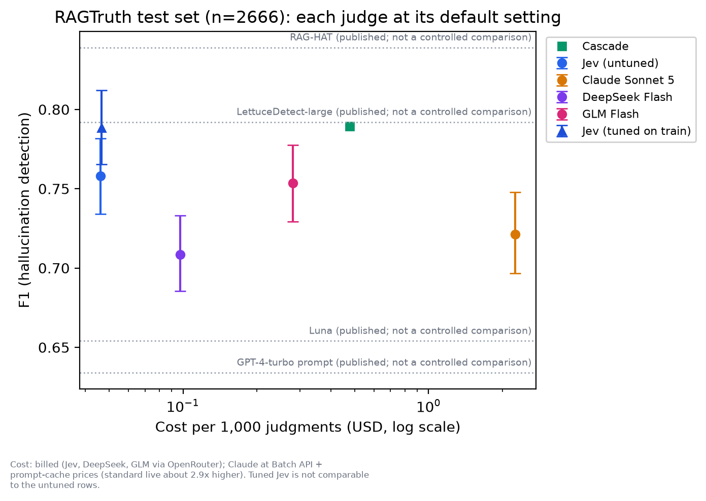
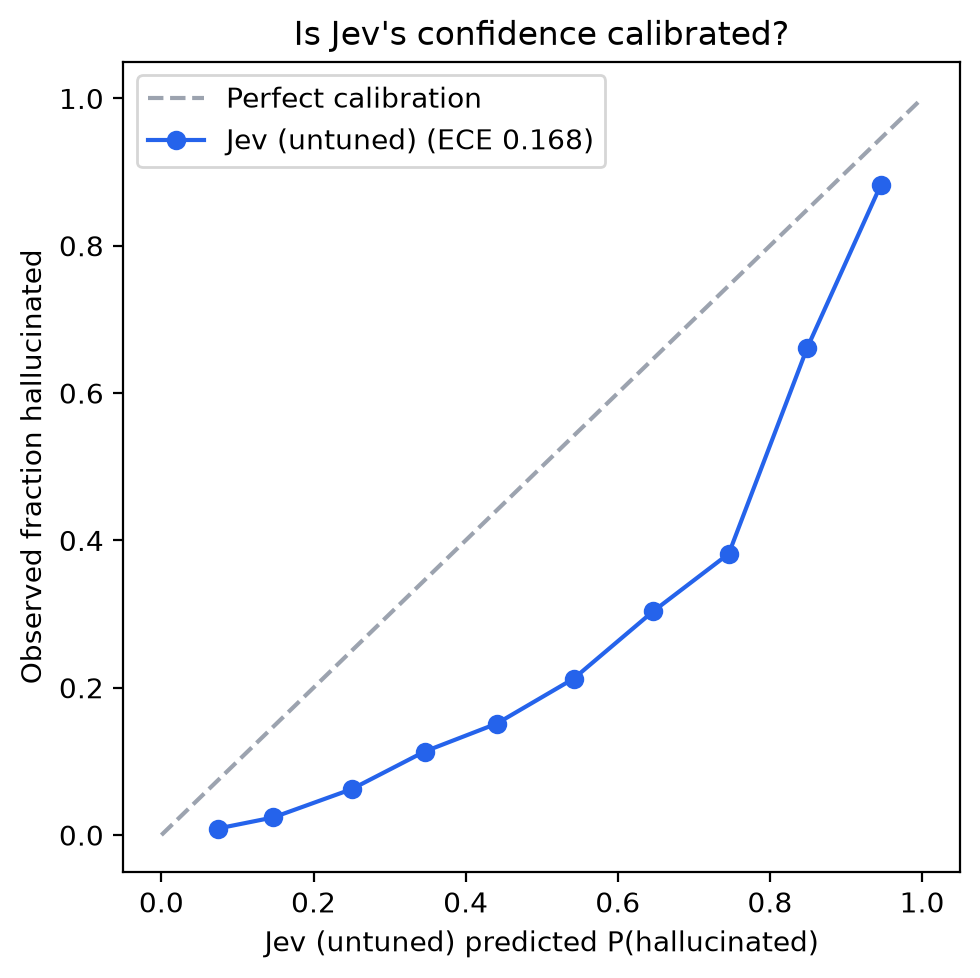
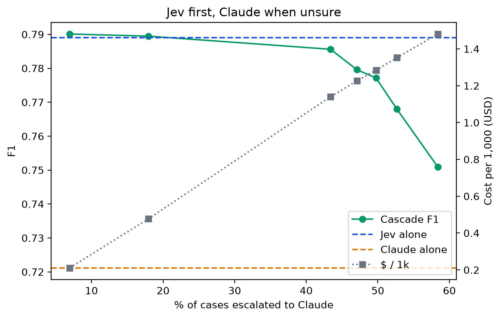
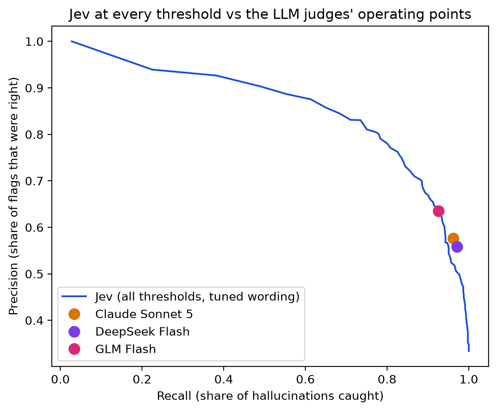
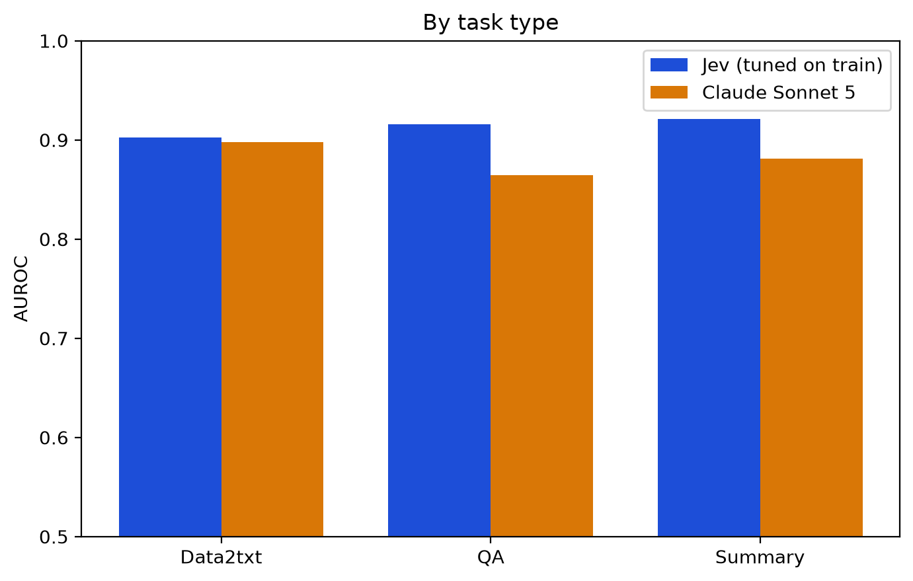

# Jev vs LLM judges on RAGTruth

## Pre-registration

**Written:** 2026-09-22, before any judge scored a single RAGTruth *test* example.
**Status of this section:** frozen. Nothing below was edited after test predictions existed.
**How it is locked:** `bench/frozen_config.json` (sha256 below) and this section are in one local git commit made before the first test-split run; the benchmark CLI refuses every test-split run until `registered: true` is set in that commit. This commit was **not** pushed or publicly timestamped before the runs — readers should weigh that accordingly.


**Frozen config sha256:** `ff0ac1e8c8b523f17ee2e33787b7cfac3b6f95598aad967bffffd9cfff6f98cc` (`bench/frozen_config.json`).

### Question
On RAGTruth's human-labeled test set, how does **Jev** (TypeSafe AI's decision model, which returns a probability that a response is fully supported) compare with LLM-as-a-judge — **Claude Sonnet 5, DeepSeek Flash, GLM Flash** — and with a **cascade** (Jev first, Claude only when Jev is unsure) at detecting hallucinated RAG answers: accuracy, cost, speed, calibration, consistency, and where each breaks?

### Frozen choices (from 600 stratified *train* examples only)
| Setting | Value | Rule used |
|---|---|---|
| Jev model | `typesafe/jev-1.13` via OpenRouter (served `jev-1.13-20260917`) | pinned |
| Tuned Jev wording | **B**: "Does the response contain any information that contradicts the source or is not stated in the source?" (inverted → P(supported) = 1 − P(yes)) | highest train AUROC among A/B/C (A 0.9031, B 0.9064, C 0.9034 — effectively tied) |
| Tuned Jev threshold | **0.165** (hallucinated iff P(supported) < 0.165) | maximizes train macro-F1 (0.838). Deviation: the plan said "round to 2 decimals"; kept exact because rounding only moves off the optimum |
| Cascade band | **(0.065, 0.265)** exclusive | widest pre-listed band centred on the threshold where Jev's train accuracy < 0.70 (0.663, n=104) |
| Untuned Jev (headline) | wording **A** ("Is every factual claim in the response supported by the source?") at **0.5** | never tuned |
| LLM judges | ragverdict's faithfulness rubric; hallucinated iff `score < 1.0` or `supported_claims < total_claims` | fixed a priori |
| Claude | `claude-sonnet-5`, thinking disabled, Batch API; temperature cannot be set (API rejects it) | product default |
| DeepSeek / GLM | `deepseek/deepseek-v4.1-flash` (thinking off, temp 0) via DeepInfra fp8 / `z-ai/glm-5.3-flash` (thinking on, effort low) via Parasail fp8; OpenRouter, provider pinned, strict JSON schema | decoding mirrors the 2026-09-19 pilot; the makers' own endpoints don't support strict JSON schema on OpenRouter, so the highest-precision endpoints that do were pinned |
| Dataset | ParticleMedia/RAGTruth @ `c103204b`, test split; primary cohort `quality == good` (2,675; 894 hallucinated); label = ≥1 span with `implicit_true == false` | fixed a priori |
| CIs | percentile bootstrap resampling whole **source documents** (1,000 resamples, seed 0); H1 uses a 90% CI | fixed a priori |

Train-set observation recorded before testing: at the default 0.5 cutoff Jev flags 27% (A) – 37% (B) of clean train answers.

### Primary hypotheses (confirmatory)
- **H1 — Jev ≈ Claude.** Untuned F1 (Jev-A @0.5 minus Claude) on the common intersection of all judges, paired source-grouped **90%** CI. *Equivalent* if the CI lies within ±0.03; *Jev worse/better* if entirely below −0.03 / above +0.03; otherwise *inconclusive*. **Prediction: inconclusive or Jev worse** (train shows heavy false alarms at 0.5).
- **H9 — the cascade barely helps.** Cascade F1 at the frozen band minus the best single judge's F1, paired 95% CI. *Confirmed* if the CI upper bound < 0.02; *refuted* if lower bound ≥ 0.02; else inconclusive. **Prediction: confirmed.**

### Exploratory (reported with CIs; not corrected for multiplicity; descriptive where n is small)
- H2 Jev's recall on numeric hallucinations, at matched false-positive rate, is lower than Claude's.
- H3 Subtle hallucinations are harder than evident ones for every judge (n=30 subtle → descriptive).
- H4 GPT-4-written hallucinations are hardest (n=40 → descriptive).
- H5 Jev degrades in the longest within-task length quartile.
- H6 Jev is overconfident in its extreme bins (observed rate outside predicted in P<0.1 or P>0.9).
- H7 Jev's AUROC varies by ≥0.03 across 6 wordings (A–E + the pilot's).
- H8 Jev's flip rate across 3 repeats ≈ 0; Claude's > 1% (Claude cannot be run at temperature 0).
- H10 When Jev and Claude agree, precision > 0.85.
- H11 Thinking-on Claude gains < 0.03 AUROC at ≥3× cost (n=150 → likely inconclusive).
- H12 Among confident judge-vs-human disagreements, ≥25% are label errors (blind human audit; confirmed only if ≥13/30). **May not be run** — depends on the author's audit.

### Sensitivity analyses (pre-specified)
Invalid/missing counted as wrong; excluding 120 convention-dependent rows (49 clean only via implicit-true spans, 71 hallucinated only via due-to-null spans); the 2026-09-19 pilot's cohort rules on QA (900 responses, any-span label).

### Disclosed before results
- These hypotheses were written after seeing the 2026-09-19 slavadubrov pilot's QA *test* results (cited, git 5e14270) and a 60-example *train* spike.
- The harness was built with Claude (Anthropic), and Claude is one of the judges. No affiliation with TypeSafe, Anthropic, DeepSeek or Zhipu.
- Jev is closed; it may have seen RAGTruth in training. Train-tune AUROC (0.90) will be reported next to test AUROC.

---

## Results

*Everything above this line was committed (`80a19cb`) before any test-split prediction existed and is unchanged. Everything below was written after the runs. "Registered" below means locally committed before the runs, not publicly timestamped (see Limitations). Headline numbers come from `bench/data/summary.json`; supplementary numbers come from `bench/data/extras.json` (`scripts/bench_extras.py`). An independent scikit-learn script (`scripts/verify_bench.py`, no shared code) re-derived the per-judge n/AUROC/F1/macro-F1/cost/ECE, the headline F1s and the H1/H9 values and verdicts: 49/49 matched. CIs, subtype, flip, agreement and cascade-sweep numbers are not covered by that check.*

### TL;DR
- **At each judge's default setting, Jev's F1 (0.758) was higher than Claude Sonnet 5's (0.721) and DeepSeek Flash's (0.708), and tied with GLM Flash (0.753),** on the same 2,666 human-labelled RAG answers.
  - Against Claude the gap is +0.037 (90% CI +0.023 to +0.050): real, but not beyond the registered ±0.03 margin, so the primary hypothesis H1 is formally **inconclusive**.
  - Against DeepSeek, Jev is clearly ahead: +0.050 [+0.034, +0.066]. Against GLM it's a tie: +0.005 [−0.010, +0.019].
- **Jev's lead comes from where its default cutoff sits, not from better per-item judgment.** At each LLM's own operating point, the LLM is equal or slightly better (clearly so vs DeepSeek). What Jev does have is a fine-grained, movable score: even at test-optimal cutoffs (optimistic for everyone), Jev reaches F1 0.797 vs 0.75–0.76 for the LLMs, whose scores are tie-heavy.
- **Cost:** Jev $0.046 per 1,000 judgments vs Claude $6.54 at standard list price (~1/140). With Claude's Batch API and prompt caching (hours of turnaround), Claude costs $2.25 (~1/50). DeepSeek costs $0.097 (~2× Jev).
- **Consistency:** in a 102-answer × 3 repeat test, Jev's verdict never flipped (95% CI 0–3.6%), though its probability moved by up to 0.11. Claude flipped on 5.9%.
- **Jev's clearest judgment gap is on hallucinations written by the strongest generators.** Jev caught 43% of GPT-4's and 50% of GPT-3.5's at its default cutoff (10% and 24% at the train-tuned cutoff), vs Claude's 65% and 83%. The n is small (40 and 42), so these are descriptive.
- **A Jev→Claude cascade matched tuned Jev on F1 (H9 confirmed)** but only traded precision for recall, at ~27× Jev's cost at live prices.

Scope: one benchmark (RAGTruth, English, 2023-era generators), one judging task (response-level faithfulness), and the LLMs judged with ragverdict's claim-level rubric.

### Headline — defaults vs defaults, common intersection (n = 2,666; 891 hallucinated)
| Judge (setting) | F1 [95% CI] | macro-F1 | Precision | Recall | False alarms / 1,775 clean | $ / 1k judgments |
|---|---|---|---|---|---|---|
| **Jev** (ragverdict default question A, P<0.5) | **0.758** [0.734, 0.782] | 0.798 | 0.650 | 0.909 | 436 (25%) | **$0.046** |
| GLM Flash (thinking on) | 0.753 [0.729, 0.777] | 0.791 | 0.635 | 0.926 | 474 (27%) | $0.28 |
| Claude Sonnet 5 (thinking off) | 0.721 [0.697, 0.748] | 0.749 | 0.577 | 0.962 | 628 (35%) | $6.54 standard · $2.25 batch+cache |
| DeepSeek Flash (thinking off) | 0.708 [0.686, 0.733] | 0.731 | 0.558 | 0.971 | 686 (39%) | $0.097 |
| *Always "hallucinated"* | 0.501 | 0.250 | 0.334 | 1.000 | 1,775 (100%) | — |
| *Jev tuned on train* (wording B, P<0.165) — **not comparable to the rows above** | 0.788 [0.765, 0.812] | 0.839 | 0.771 | 0.807 | 214 (12%) | $0.046 |

CIs are percentile bootstrap resampling whole RAGTruth source documents (~6 answers each), 1,000 resamples. They reflect document sampling, not judge randomness, and each judge was run once. LLM judges count as "hallucinated" iff `score < 1.0` or `supported_claims < total_claims` (registered rule; the two disagree on 0.6% of Claude's answers). Failed outputs: Jev 0, Claude 0, GLM 1 (invalid JSON), DeepSeek 8 (truncated at the pilot-style 512-token cap). Counting them as wrong changes no F1 by more than 0.003.

Latency (per call, harness-dependent, not a controlled test): Jev p50 0.27 s (8 concurrent workers), DeepSeek 2.1 s, GLM 2.9 s (8 workers), Claude live p50 3.0 s / p95 4.9 s (sequential, 102-answer sample).



### Registered hypotheses
| # | Prediction | Result | Verdict |
|---|---|---|---|
| **H1** (primary) | Jev ≈ Claude within ±0.03 F1 (expected: inconclusive or Jev worse) | Jev − Claude = **+0.037**, 90% CI [+0.023, +0.050] | **Inconclusive**, matching the prediction. The point estimate favors Jev, the opposite of the concern behind it. Sensitivity (excluding 120 convention-dependent rows): +0.045 [+0.031, +0.060], just past the margin. |
| **H9** (primary) | Cascade beats the best single judge by < 0.02 | 0.789 − 0.788 = **0.000**, 95% CI [−0.012, +0.012] | **Confirmed.** Note: the best judge is fixed by point F1, which leans toward "confirmed". |
| H2 | Jev misses more numeric hallucinations (matched false-positive rate) | recall 0.945 vs Claude 0.969, diff −0.024 [−0.054, +0.004] | Inconclusive (direction as predicted) |
| H3 | Subtle hallucinations are harder; Jev drops more | subtle recall: Jev 0.57 (default) / Claude 0.83, n=30 | Supported, descriptive |
| H4 | GPT-4's hallucinations are hardest | lowest recall for most judges (Jev 0.43, Claude 0.65, n=40) | Supported, descriptive |
| H5 | Jev degrades on the longest inputs (within task) | Summary AUROC 0.949 (Q1) → 0.876 (Q4); quartile CIs overlap; Claude also dips on long Summaries | Suggestive only |
| H6 | Jev is overconfident at the extremes | P(halluc)>0.9: predicted 0.949 vs observed 0.889 (bootstrap CI [0.854, 0.921]); P<0.1: predicted 0.070 vs observed 0.007 | Confirmed at the top; *under*confident (safer) at the bottom. Overall ECE 0.168 |
| H7 | Jev's AUROC varies ≥ 0.03 across 6 wordings | AUROC 0.913–0.922 | **Refuted for ranking.** But F1 at the fixed 0.5 cutoff varies 0.699–0.763 across wordings, so the cutoff has to be set per wording |
| H8 | Jev flip rate ≈ 0; Claude > 1% | Jev 0/102 (CI to 3.6%; cache hits ruled out); Claude 6/102 (5.9% [2.7%, 12.2%], Wilson) | Confirmed. Claude's temperature can't be set via the API; DeepSeek/GLM not tested |
| H10 | When Jev and Claude agree, precision > 0.85 | both-flag precision 0.684 (default Jev) / 0.775 (tuned Jev) | Refuted |
| H11 | Thinking-on Claude gains < 0.03 AUROC at ≥3× cost | — | Pending at time of writing |
| H12 | ≥25% of confident disagreements are label errors | — | Not run |

H2–H12 are exploratory: no multiplicity correction, descriptive where n < 50. H6, H8 and H10 CIs are Wilson intervals where noted (a deviation from the registered bootstrap; the bootstrap intervals are in summary.json where computed).

### What the numbers say
**1. Under ragverdict's claim-level rubric, all three LLM judges over-flag.** They catch 93–97% of hallucinations but flag 27–39% of clean answers. Much of this is the rubric (any unsupported claim → hallucinated): with a simpler yes/no prompt, DeepSeek's QA false alarms fell from 238 to 139 of 740 (Appendix A). Jev at its default flags 25% of clean answers.

**2. Same ranking ability, different defaults.**
- At Claude's precision (0.577), Jev's recall is 0.944 [0.923, 0.963] vs Claude's 0.962. At Claude's recall, Jev's precision is 0.540 [0.494, 0.579] vs 0.577.
- Setting Jev to flag exactly as many answers as each LLM gives F1 0.712 vs Claude 0.721, 0.696 vs DeepSeek 0.708 and 0.749 vs GLM 0.753.
- At a matched false-positive rate Claude's recall is higher on most subtypes. The clearest gaps are conflicting claims (−0.028 [−0.051, −0.006]) and GPT-3.5's answers (−0.14 [−0.28, −0.03], n=42).
- Jev's advantage is its **continuous score**. Claude's claim fraction is exactly 1.0 for 44% of answers, so even its test-optimal cutoff peaks at F1 0.748, vs Jev's 0.797. AUROC (Jev 0.922 vs Claude 0.894) overstates the gap for the same reason.

**3. Disagreements mostly reflect Claude's flag rate.** Default Jev and Claude disagree on 373 answers. 306 are answers Claude flags and Jev passes (255 of them clean), and 67 are the reverse (63 clean). Jev is "right" 259 times vs 114, but that's Claude's higher false-alarm rate, not better item-level judgment.

**4. The cascade traded precision for recall, not quality.** Sending Jev's uncertain 18% (P between 0.065 and 0.265) to Claude:
- raised recall from 0.807 to 0.872 and false alarms from 214 to 302, with F1 flat;
- inside that band, Claude (under our rubric) flagged 95% of answers and was less accurate than Jev (0.53 vs 0.59);
- costs $0.48 per 1k at Claude batch price, ≈ $1.27 per 1k at live standard price.

A better-calibrated second judge might do better; we didn't test one. The swept bands (7–58% escalated; chosen on test, so optimistic) all scored F1 0.751–0.790.

**5. Consistency.** Jev's verdicts didn't flip across repeats, but its scores are not fixed. They changed on 74/102 answers (median 0.01, max 0.11), and 4.5% of test answers sit within ±0.03 of the tuned cutoff, so flips will happen at scale. Claude flipped verdicts on 5.9% of answers. That's one run of each at the API's settings; a temperature-0 LLM might be steadier.

**6. Tuning is a trade, not a free lunch.** Choosing wording B and cutoff 0.165 on 600 *train* answers:
- halved false alarms (436 → 214) but doubled missed hallucinations (81 → 172);
- raised pooled F1 (0.758 → 0.788) but lowered Summary F1 (0.749 → 0.718).

The tune set was more hallucinated than test (38.7% vs 33.4%). Jev's test AUROC (0.922) is slightly above train (0.903): no sign of tuning overfit. That does **not** rule out contamination, since a model trained on RAGTruth would likely have seen both splits.

**7. At realistic base rates, every judge's flags are mostly false alarms.** Using the observed rates at 5% hallucination prevalence, the share of flags that are real is ~16% for default Jev, ~26% for tuned Jev and ~12–13% for the LLMs.

   

### By task (F1, descriptive; each judge's own scored cohort)
| Task | Jev default | Jev tuned | Claude | GLM | DeepSeek | always-flag |
|---|---|---|---|---|---|---|
| QA (web passages; 134 positives) | 0.534 | 0.615 | 0.494 | 0.541 | 0.493 | 0.266 |
| Summary (news; 196) | 0.749 | 0.718 | 0.619 | 0.641 | 0.632 | 0.356 |
| Data2txt (business JSON; 564) | 0.848 | 0.866 | 0.861 | 0.886 | 0.826 | 0.770 |

Data2txt holds 63% of all hallucinated answers, so it dominates pooled F1, and there GLM and Claude beat default Jev. Jev's pooled lead comes from Summary and QA.

### How Jev fails (hand-read; 20 cases; one reader; descriptive)
We read 10 answers Jev missed that Claude caught, and 10 clean answers Jev flagged that Claude passed.

**Misses** are mostly errors built from the source's own words but with the meaning changed:
- a role swap ("the worker was sued" when the employer was);
- a negation;
- a 24-hour time misread ("7:0–17:0" → "7 PM");
- a missing JSON value written as "not".

Jev is often fairly confident on these (median P(supported) 0.64).

**False alarms** cluster near the cutoff (45 of 63 within 0.1 of it). Several are small unsupported flourishes the human annotators tolerated: clean business descriptions containing "popular" were flagged 77% of the time by Jev and 71% by Claude, vs 28–38% without it.

Three of the 20 human labels looked debatable, and in one only Jev was arguably right.

### Practical guidance for Jev as a judge
- **Set the cutoff on your own labeled data, per question wording.** F1 at 0.5 ranged 0.699–0.763 across six wordings. Decide what a miss costs vs a false alarm: tuning for F1 here halved false alarms but doubled misses.
- **In ragverdict, `judge: jev` scores faithfulness as P(fully supported).** The default `faithfulness_pass: 0.85` / `weak: 0.7` were designed for an LLM's claim fraction and are too strict. Start near `pass: 0.5`, `weak: 0.2` for the default question, then calibrate (see `examples/demo_rag/config.jev.yaml`). ragverdict warns when these defaults are kept.
- **Keep an LLM where you need to know *why*** (Jev returns no explanation), and where subtle, fluent hallucinations from strong generators matter most.
- **Only faithfulness was benchmarked.** Jev's relevance, refusal and pushback questions in ragverdict are unvalidated.

### Sensitivity analyses
- **Invalid counted as wrong:** every F1 within 0.003 of the headline.
- **Excluding 120 convention-dependent rows** (49 answers clean only because their flagged spans are "true but unstated"; 71 hallucinated only via "due to null" spans): Jev − Claude = +0.045 [+0.031, +0.060].

### Limitations and disclosures
- **Scope:** one dataset and one judging task (response-level faithfulness on RAGTruth). English only. Answers from 2023-era generators (GPT-3.5/4, Llama-2, Mistral); the strongest generators were the hardest for Jev.
- **Labels:**
  - RAGTruth's labels are noisy (the blind label audit, H12, was not performed);
  - 120 answers depend on labeling conventions;
  - the hand-read found 3 of 20 labels debatable.
- **Contamination:** RAGTruth has been public since 2024. Any judge, including closed Jev, may have seen it.
- **Inputs:** judges read the full generator prompt (instructions + passages or a Python-dict JSON with nulls) as the source, so they may also judge instruction compliance.
- **Judge settings:**
  - LLMs used ragverdict's claim-level rubric; a simpler prompt changes their numbers (Appendix A);
  - decoding differs: Claude thinking off with an API-fixed temperature, DeepSeek thinking off at temperature 0, GLM thinking on;
  - DeepSeek and GLM ran on OpenRouter endpoints pinned to DeepInfra and Parasail (fp8), because the makers' own endpoints there didn't support strict JSON schema.
- **Costs and latency:**
  - costs are token counts × list prices dated 2026-09-22 (Claude) or OpenRouter's billed `usage.cost` (Jev, DeepSeek, GLM), not reconciled with invoices;
  - the cascade's $0.48 uses Claude batch prices, and a live cascade would pay ≈ $1.27;
  - latency is harness-dependent (concurrency, retries, sample), from one location on one day;
  - Claude's batch sat several hours in Anthropic's queue, a queueing property not a model property.
- **Registration:** the frozen config and hypotheses were committed before the runs (`80a19cb`) but not publicly timestamped. They were written after seeing an earlier QA-only pilot's results and a 60-example train spike.
- **Conflicts:**
  - the author maintains ragverdict, which ships a `judge: jev` backend with wording A as its default;
  - the harness was built with Claude, and Claude is one of the judges;
  - no affiliation with TypeSafe, Anthropic, DeepSeek or Zhipu, and no payment.

### Deviations from the registered plan
- **Cutoff and band:**
  - the tuned threshold was kept at 0.165 rather than rounded;
  - Jev returns 2-decimal scores, so 0.165 and 0.17 give identical verdicts;
  - the cascade band was recomputed around 0.165 with the pre-declared rule before freezing.
- **Providers:** DeepSeek and GLM providers were changed before the freeze (see Limitations).
- **Run sizes:** the Claude flip and thinking-on runs were resized (102 and 150 examples) to fit the budget.
- **Numeric-span definition, fixed after results:** month names are now matched case-sensitively, so "may"/"march" no longer count as dates. This affected 22 of 894 hallucinated answers; H2 stayed inconclusive (before: −0.025 [−0.054, +0.003]).
- **CIs:** some reported CIs are Wilson intervals rather than the registered cluster bootstrap (marked where used).
- **Claude wall clock:** the recorded value covers only the resumed download, because the original polling process was interrupted.
- **Pending and not run:** H11 was pending and H12 was not run at the time of writing.

### FAQ
- **"You tuned Jev and not the LLMs."** The headline is defaults vs defaults. Even at test-optimal cutoffs (optimistic for all), the LLMs peak at F1 0.748–0.757 vs Jev's 0.797. But at the LLMs' own operating points they're equal or better.
- **"Why is wording A 'untuned'?"** It's ragverdict's shipped default, fixed before the test runs. All six wordings at 0.5: A 0.758, C 0.763, D 0.737, E 0.728, B 0.720, P 0.699.
- **"Is Jev deterministic?"** Verdicts were stable in 306 repeat calls, but scores move by up to 0.11.
- **"What about specialized detectors (LettuceDetect, RAG-HAT, HHEM)?"** Not run. Their published RAGTruth F1s (0.79, 0.84; different filters) are drawn on the chart for context only.
- **"Why F1 and not AUROC?"** AUROC flatters Jev because the LLM scores are tie-heavy. Both are reported, with macro-F1.

### Reproduce
```bash
git clone https://github.com/Shauryagulati/ragverdict && cd ragverdict
pip install -e ".[bench]"
# Re-score from the published raw predictions (no API calls):
mkdir -p bench_results/raw && for f in docs/bench/data/raw/*.jsonl.gz; do gunzip -c "$f" > "bench_results/raw/$(basename "$f" .gz)"; done
ragverdict bench ragtruth summarize --out bench_results
python scripts/verify_bench.py --out bench_results \
  --data ~/.cache/ragverdict/ragtruth/c103204b9ce28d6bbad859304bf30de72b8ed8fe \
  --frozen bench/frozen_config.json
python scripts/bench_extras.py --out bench_results --frozen bench/frozen_config.json
# Re-run the judges (needs API keys; ~$9 Anthropic + ~$2.5 OpenRouter at 2026-09 prices):
ragverdict bench ragtruth run jev jev-para-A claude deepseek glm --max-spend-usd 12
```

### Appendix A — Comparison with an earlier pilot
A pilot by another author (`slavadubrov/sgr-judge-bench`, commit `5e14270`, 2026-09-19, since removed from the repository) evaluated Jev and LLM judges on RAGTruth's 900 QA answers. Its rules differ from ours:
- all answers kept, and any annotated span counts as hallucinated;
- a binary yes/no prompt;
- Jev at 0.5 with `{question, context, answer}` inputs.

With its exact prompt, inputs and rules we get macro-F1 Jev 0.693 (pilot reported 0.667), DeepSeek 0.772 (0.730) and GLM 0.750 (0.766). Its conclusion that cheap LLMs beat Jev reproduces under its setup, where Jev's default cutoff yields ~220–290 false alarms out of 740 clean answers. On the same 900 answers, Jev with our train-tuned cutoff reaches 0.804 (93 false alarms); that row is tuned and the LLM rows are not. Our claim-level rubric scored DeepSeek and GLM lower on QA (0.684 / 0.732) than the binary prompt did.

### Appendix B — Where each number comes from
**`bench/data/summary.json`:**
- headline: `headline`;
- H1/H9: `hypotheses`;
- H2: `subtypes.matched_fpr.claude.subtypes`;
- H5: `judges.*.by_length_quartile`;
- H6: `calibration_extremes`;
- H7: `paraphrases`;
- H8: `flip`;
- threshold-free: `headline.threshold_free`;
- costs: `headline.cost_basis`;
- sensitivity: `sensitivity`;
- pilot comparison: `qa_replication_pilot_rules`, `pilot_reference_qa`.

**`bench/data/extras.json`:**
- disagreements, agreement precision (H10);
- recall by generator and severity (H3/H4);
- false alarms on the headline cohort, always-flag baselines;
- test-optimal F1, F1 at matched flag rate;
- score jitter, cascade detail and live cost;
- ECE, tune-set prevalence, base-rate precision;
- paired default-vs-GLM/DeepSeek diffs, per-wording F1.
